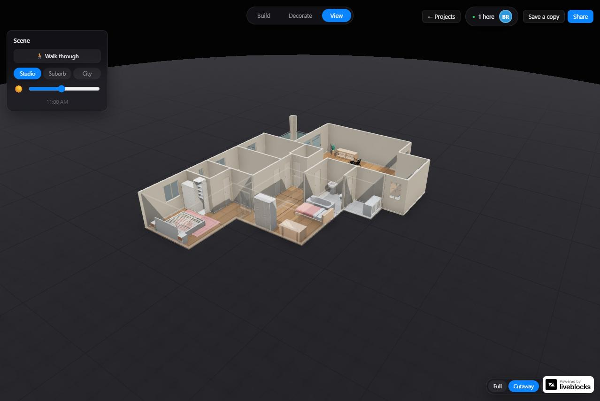
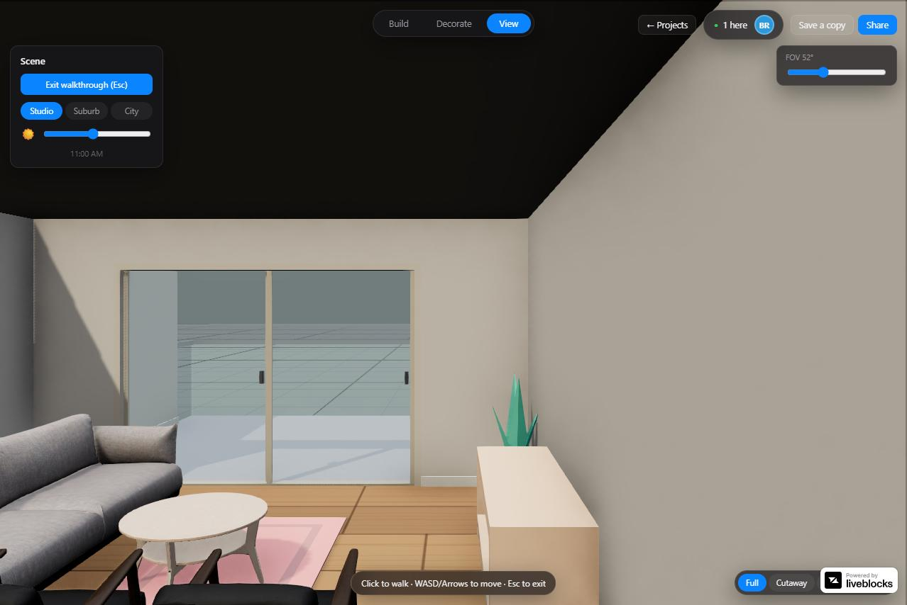
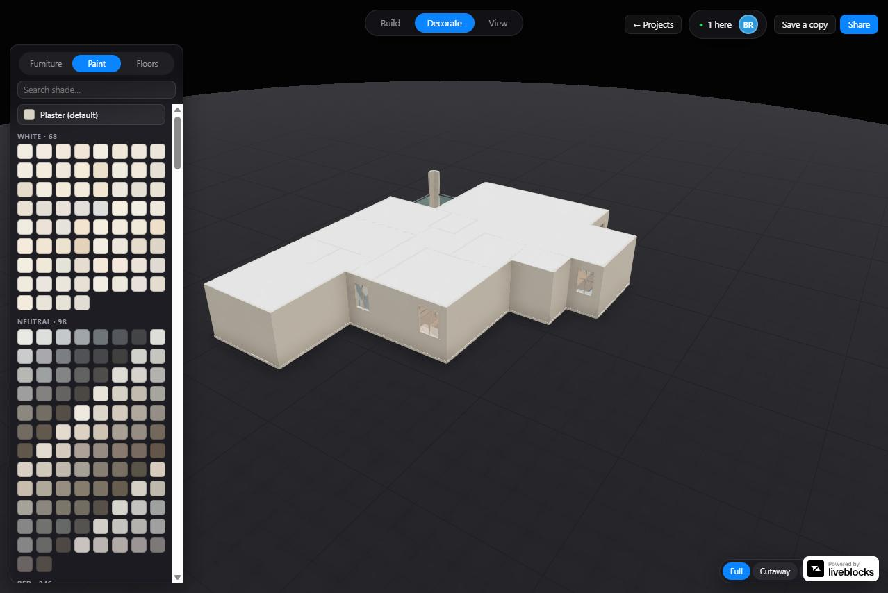

# floorplan-3d

**Goal: the best editable 3D home design experience — one a user can trust.**
Upload a floorplan and, moments later, walk around your own home in 3D and start
designing it. The enabling technology — and where our effort goes right now — is
**automatically and faithfully understanding the uploaded floorplan**:
generalizing across drawing styles, countries, languages, and scan quality with
no plan-specific tuning, so the user can trust the generated home without
verifying every wall, door, and window. Perception is the current bottleneck to a
magical product, not the product itself; the technology stays invisible.



📖 **See [`docs/VISION.md`](docs/VISION.md) for the full project vision — why the
design experience is the destination and automatic understanding is the current
bottleneck.**  That document is the north star; every architectural decision is
justified against it.

## What's here

- A **Next.js / React Three Fiber** app: upload or trace a floorplan, edit it in
  2D, and render/walk it in 3D — walls, openings, furniture (a real IKEA
  catalog), paint, and floors — with live multi-user co-editing.
- A **ground-up rebuild of the floorplan-understanding pipeline** (Python), built
  phase-by-phase against a held-out benchmark rather than tuned per plan. This is
  the active R&D surface of the project.

| Walkthrough mode | Material / paint catalog |
|---|---|
|  |  |

## Documentation

- [`docs/VISION.md`](docs/VISION.md) — north star: why this is a design-experience product, not a floorplan parser
- [`docs/ARCHITECTURE.md`](docs/ARCHITECTURE.md) — the reasoning-engine architecture behind the understanding pipeline
- [`docs/technical-summary.md`](docs/technical-summary.md) — how tracing and understanding actually work today
- [`CLAUDE.md`](CLAUDE.md) — the working rules this project is built under (phase gates, frozen contracts, protected paths)

## Getting started

The product (Next.js app):

```bash
npm install
npm run dev
```

Open [http://localhost:3000](http://localhost:3000).

The extraction/understanding pipeline (Python, standalone service, consumed by
the app through a JSON contract — see [`CLAUDE.md`](CLAUDE.md) for the full
repo map):

```bash
pip install -r extraction/requirements.txt
python -m eval.cli run
```

## License

All rights reserved. Source is visible for portfolio purposes; no license is
granted for reuse or redistribution.
